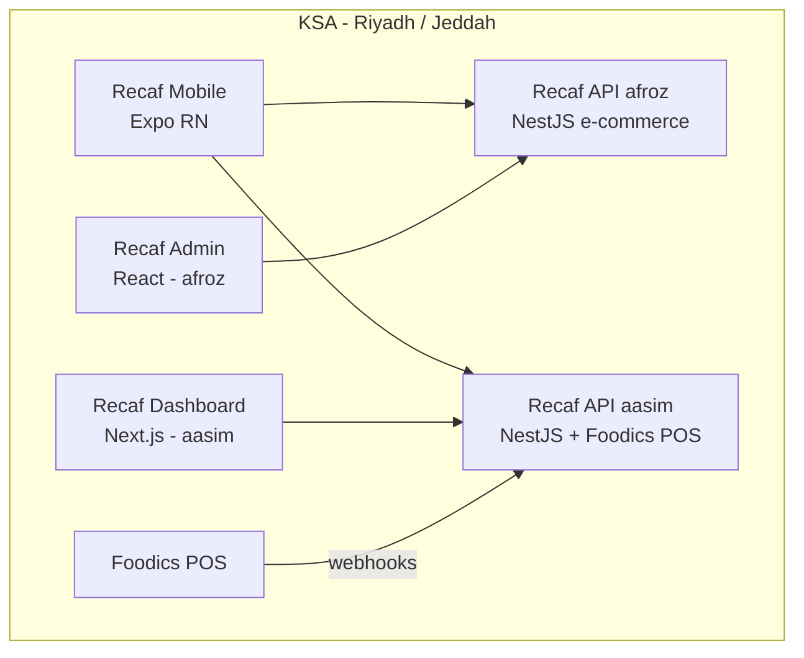
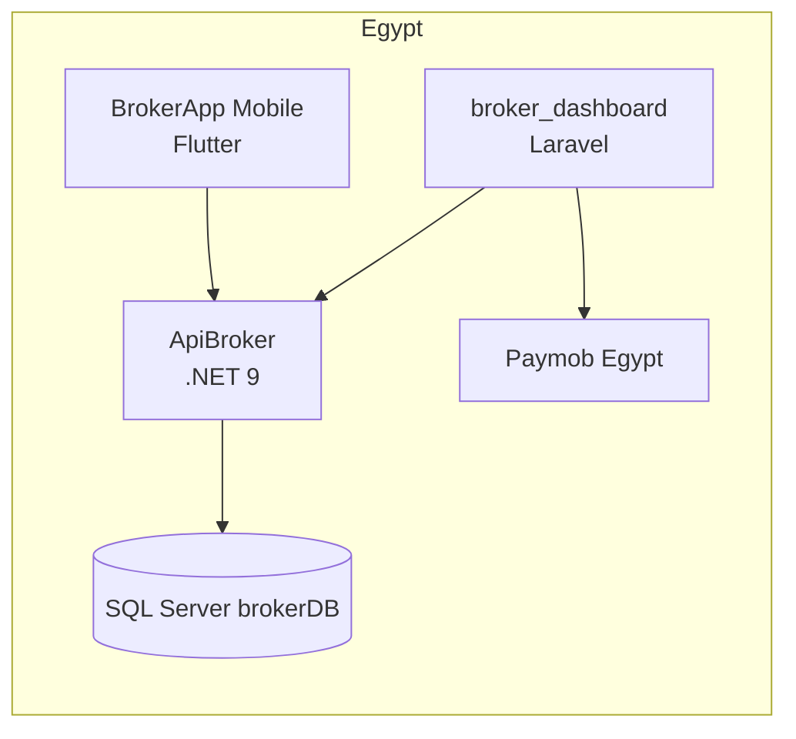
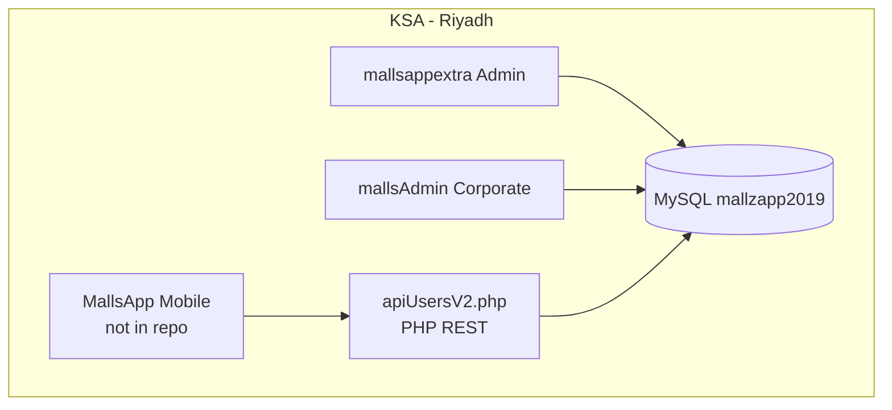

# All Apps — Complete Documentation

Single consolidated reference for every project in the codebase.  
Generated: June 16, 2026

---

## Table of Contents

1. [Quick Reference](#quick-reference)
2. [Folder Structure](#folder-structure)
3. [Ecosystem Maps](#ecosystem-maps)
4. [Projects by Region](#projects-by-region)
5. [All Projects (Full Detail)](#all-projects-full-detail)
   - [NCD International](#1-ncd-international)
   - [Recaf API (afroz)](#2-recaf-api-afroz)
   - [Recaf Admin Dashboard (afroz)](#3-recaf-admin-dashboard-afroz)
   - [Recaf Mobile](#4-recaf-mobile)
   - [MallsApp Backend + Admin](#5-mallsapp-backend--admin)
   - [Recaf API (aasim — Production)](#6-recaf-api-aasim--production)
   - [Recaf Dashboard (aasim)](#7-recaf-dashboard-aasim)
   - [plusUltra](#8-plusultra)
   - [Furns Rentals](#9-furns-rentals)
   - [ApiBroker (.NET API)](#10-apibroker-net-api)
   - [Broker Dashboard (Laravel)](#11-broker-dashboard-laravel)
   - [Broker Mobile App (Flutter)](#12-broker-mobile-app-flutter)
   - [LAGO Website](#13-lago-website)
6. [Cross-Project Notes](#cross-project-notes)

---

## Quick Reference

| # | Project | Owner Folder | Region | Type | Port | Live URL |
|---|---------|--------------|--------|------|------|----------|
| 1 | NCD International | `ahmed/ncdinternational` | USA + India | Portfolio SPA | 5173 | — |
| 2 | Recaf API (afroz) | `afroz/recaf` | **KSA / Riyadh** | NestJS API | 8012 | — |
| 3 | Recaf Admin (afroz) | `afroz/recaf/admin-dashboard` | **KSA** | React admin | 5173 | — |
| 4 | Recaf Mobile | `afroz/recaf-mobile` | **KSA / Riyadh** | Expo RN | 8081 | — |
| 5 | MallsApp | `afroz/mallsapp-backend` | **KSA / Riyadh** | PHP + MySQL | 80/443 | cp.mallsapp.me |
| 6 | Recaf API (aasim) | `aasim/recaf-api` | **KSA / Riyadh** | NestJS + Foodics | 8012 | api.recaf.sa |
| 7 | Recaf Dashboard | `aasim/recaf-dashboard` | **KSA** | Next.js admin | 3000 | — |
| 8 | plusUltra | `aasim/plusUltra` | Global | Next.js productivity | 3000 | Vercel |
| 9 | Furns Rentals | `afreen/furns-rentals` | Events / rental | Next.js + Prisma | 3000 | furns-rentals.vercel.app |
| 10 | ApiBroker | `usama/ApiBroker` | **Egypt** | .NET 9 API | 5204 | api.brokerapp.me |
| 11 | Broker Dashboard | `usama/broker_dashboard` | **Egypt** | Laravel + Vite | 8000 | brokerapp.me |
| 12 | Broker Mobile | `usama/BrokerApp-Frontend` | **Egypt** | Flutter | — | — |
| 13 | LAGO Website | `lago-website/` | **KSA / Riyadh** | Laravel + Vue | 8000 | — |

---

## Folder Structure

```
codebase/
├── afroz/
│   ├── recaf/                  # NestJS API + admin-dashboard
│   ├── recaf-mobile/           # Expo consumer app
│   └── mallsapp-backend/       # PHP backend + 2 admin panels
├── ahmed/
│   └── ncdinternational/       # Architecture portfolio SPA
├── afreen/
│   └── furns-rentals/          # Event furniture rental platform
├── aasim/
│   ├── recaf-api/              # Production Recaf API + Foodics
│   ├── recaf-dashboard/        # Production admin dashboard
│   └── plusUltra/              # Personal productivity app
├── usama/
│   ├── ApiBroker/              # .NET REST API
│   ├── broker_dashboard/       # Laravel admin + landing
│   └── BrokerApp-Frontend/     # Flutter mobile app
└── lago-website/               # LAGO restaurant site + admin
```

---

## Ecosystem Maps

### Recaf (Saudi Arabia — Coffee Loyalty)



### Broker (Egypt — Real Estate)



### MallsApp (Saudi Arabia — Mall Shopping)



---

## Projects by Region

| Region | Projects |
|--------|----------|
| **Saudi Arabia (KSA)** | Recaf (all), MallsApp, LAGO Website |
| **Egypt** | ApiBroker, Broker Dashboard, Broker Mobile |
| **USA + India** | NCD International |
| **Global / Other** | plusUltra, Furns Rentals |

---

## All Projects (Full Detail)

---

### 1. NCD International

| Field | Value |
|-------|-------|
| **Path** | `c:\Users\aasim\Documents\codebase\ahmed\ncdinternational` |
| **Region** | USA (Raleigh, NC) + India (Hyderabad) |
| **Type** | Static portfolio / architecture studio website |

**Purpose:** Public portfolio for **NCD International** — an architecture and design studio showcasing civic, cultural, and residential projects worldwide. Features a Three.js interactive globe hero, GSAP animations, and Lenis smooth scrolling.

**Tech Stack:**

| Layer | Technology |
|-------|------------|
| Language | TypeScript |
| Build | Vite 5 |
| 3D | Three.js + GLSL shaders |
| Animation | GSAP, Lenis |
| Physics | Matter.js (floating tags) |
| Content | `public/data/projects.json` (generated from assets) |
| Images | Sharp (build-time optimization) |

**How to Run:**

```bash
cd ahmed/ncdinternational
npm install
npm run dev        # http://localhost:5173
npm run build
npm run preview    # http://localhost:4173
npm run data:projects   # regenerate projects.json from assets
```

Requires Node >= 18.18.

**Application Flow:**

| Route | Page |
|-------|------|
| `/` | Home — globe hero, featured projects carousel |
| `/about` | About the studio |
| `/projects` | Project index |
| `/projects/:slug` | Project detail |
| `/references` | Client references |
| `/team` | Team page |
| `/contact` | Contact form |

No backend at runtime — fully static SPA. Content pipeline: drop images in `public/assets/projects/<folder>/` → run `npm run data:projects`.

---

### 2. Recaf API (afroz)

| Field | Value |
|-------|-------|
| **Path** | `c:\Users\aasim\Documents\codebase\afroz\recaf` |
| **Region** | **Saudi Arabia (KSA)** — Riyadh coordinates, SAR currency, +966 phones |
| **Type** | NestJS REST API — coffee e-commerce + loyalty |

**Purpose:** Backend for the Recaf specialty coffee platform. Handles user auth, product catalog (coffee, gift boxes, gear), shopping cart, coupons, store locator, home banners, and loyalty wallet scanning.

**Tech Stack:**

| Layer | Technology |
|-------|------------|
| Language | TypeScript |
| Framework | NestJS 11 |
| ORM | Prisma 7 + `@prisma/adapter-pg` |
| Database | PostgreSQL |
| Auth | JWT (Passport), bcrypt |
| Storage | AWS S3 (presigned uploads) |

**How to Run:**

```bash
cd afroz/recaf
npm install
# Set DATABASE_URL in .env
npx prisma migrate dev
npm run seed          # demo data (Saudi phone, Riyadh coords)
npm run start:dev     # http://localhost:8012
```

**Key API Routes:**

| Prefix | Features |
|--------|----------|
| `/auth/*` | Register, login, me |
| `/home` | Banners, categories feed |
| `/catalog/*` | Products, variants, pricing |
| `/cart/*` | Add items, apply coupons |
| `/stores` | Store locator |
| `/loyalty/scan/:walletId` | QR wallet scan |
| `/users/me` | Profile (JWT protected) |
| `/admin/*` | Full CRUD for catalog, coupons, stores, banners |

**Data Models:** User, UserAddress, Category, Product, ProductVariant, Cart, CartItem, Coupon, Store, HomeBanner.

**Related:** Admin UI → `afroz/recaf/admin-dashboard` | Mobile → `afroz/recaf-mobile`

---

### 3. Recaf Admin Dashboard (afroz)

| Field | Value |
|-------|-------|
| **Path** | `c:\Users\aasim\Documents\codebase\afroz\recaf\admin-dashboard` |
| **Region** | **KSA** (inherits from Recaf backend) |
| **Type** | React SPA admin console |

**Purpose:** Admin panel for the afroz Recaf backend — manage users, categories, products, variants, coupons, stores, banners, and image uploads.

**Tech Stack:** React 19, TypeScript, Vite 8, ESLint 9

**How to Run:**

```bash
cd afroz/recaf/admin-dashboard
npm install
cp .env.example .env
# VITE_API_BASE_URL=http://localhost:8012
npm run dev     # http://localhost:5173
```

**Application Flow:** Single-page tabbed UI:
- **Users** — create, edit, activate/deactivate, profile images
- **Categories / Products / Variants** — catalog management
- **Coupons / Stores / Banners** — promotions and locator content
- **Image upload** — posts to `/admin/uploads/file`

---

### 4. Recaf Mobile

| Field | Value |
|-------|-------|
| **Path** | `c:\Users\aasim\Documents\codebase\afroz\recaf-mobile` |
| **Region** | **Saudi Arabia (KSA)** — bundle `com.sa.sao.recaf`, SAR, Arabic |
| **Type** | Expo / React Native consumer app |

**Purpose:** Mobile app for Recaf coffee — home feed, store locator (Google Maps), rewards/loyalty, profile, cart, product browsing, push notifications (Firebase), bilingual EN/AR.

**Tech Stack:**

| Layer | Technology |
|-------|------------|
| Framework | Expo 54, Expo Router 6 |
| UI | React Native 0.81, NativeWind/Tailwind |
| State | Zustand |
| i18n | i18next (EN + AR) |
| HTTP | Axios |
| Maps | react-native-maps, Google Maps SDK |
| Push | Firebase Messaging, expo-notifications |

**How to Run:**

```bash
cd afroz/recaf-mobile
npm install
cp .env.example .env
# EXPO_PUBLIC_API_URL or HOST+PORT (default 8012)
npm start           # Expo dev server
npm run android
npm run ios
npm run web         # http://localhost:8081 (maps not supported on web)
npm test
```

**Screen Flow:**

```
Splash → Login (phone) → Tabs
  ├── Home (banners, categories, products)
  ├── Locator (Google Maps stores)
  ├── Rewards (loyalty points)
  └── Profile
Cart → Menu → Search → Product/[id] → Rewards/Scanner → Notifications
```

---

### 5. MallsApp Backend + Admin

| Field | Value |
|-------|-------|
| **Path** | `c:\Users\aasim\Documents\codebase\afroz\mallsapp-backend` |
| **Region** | **Saudi Arabia / GCC** — Asia/Riyadh timezone, EN/AR |
| **Type** | PHP backend + 2 admin panels (mobile app source not in repo) |

**Purpose:** Backend and admin systems for **MallsApp** — a mall shopping mobile app for KSA. Provides unified mobile API for malls, brands, cinema, events, offers, shopping lists, loyalty cards, parking, receipts, and push notifications.

**Production URLs:**

| Environment | URL |
|-------------|-----|
| Production API | `https://cp.mallsapp.me/mallsappextra/apis/v2` |
| Staging API | `https://stg.cp.mallsapp.me/mallsappextra/apis/v2` |
| Public site | `http://mallsapp.me` |
| Admin | `https://cp.mallsapp.me/mallsappextra/index.php` |
| Corporate admin | `http://cp.mallsapp.me/mallsAdmin/` |

**Tech Stack:**

| Layer | Technology |
|-------|------------|
| Language | PHP |
| Server | Apache on AWS EC2 |
| Database | MySQL (`mallzapp2019`) |
| Admin UI | Bootstrap SB Admin 2 |
| Cloud | AWS SDK (S3), Twilio |
| CI/CD | GitHub Actions → EC2 (main=prod, dev=staging) |
| API docs | OpenAPI 3.0 |

**Sub-Projects:**

**mallsappextra (Main Backend + Admin)** — `mallsapp-backend/mallsappextra`  
Full **Brands App v2.0** operations dashboard + mobile API entry point `apis/apiUsersV2.php`.  
Admin features: Dashboard, Events, Brands, Malls, Cities, Approval Center, Users, App Users, Loyalty Cards, Push Messages, Error Messages (EN/AR), Backups, Reports.  
Approval system: Junior admins stage changes; super admins execute immediately.

**mallsAdmin (Corporate Admin)** — `mallsapp-backend/mallsAdmin`  
Lighter corporate/brand partner admin — manage assigned brands, malls, requests, users.

**Mobile API Flow:** Entry `apis/apiUsersV2.php` — dispatches 70+ `api_calls`:
- Auth: register, login, verify, logout
- Location: Country, city, dialCodes
- Malls/brands: mallsInfo, brandsInfo, offersList, searchInMalls
- Cinema: movieList, movieDetails
- Events: eventsList, eventDetails
- Shopping lists, loyalty cards, parking, receipts, reviews, FCM

**How to Run Locally:**

```bash
# Create MySQL database: mallzapp2019
cd afroz/mallsapp-backend/mallsappextra
composer install
php db/migrate.php
# Serve under Apache docroot
```

**Note:** The native MallsApp mobile client is **not** in this repository.

---

### 6. Recaf API (aasim — Production)

| Field | Value |
|-------|-------|
| **Path** | `c:\Users\aasim\Documents\codebase\aasim\recaf-api` |
| **Region** | **Saudi Arabia (KSA)** — Riyadh, Jeddah stores; `recaf.sa` domain |
| **Type** | NestJS + Fastify REST API with Foodics POS integration |

**Purpose:** Production backend for the Recaf cafe **loyalty platform**. Serves mobile app, admin dashboard, and Foodics POS (earn/redeem points, rewards, stores, notifications).

**Tech Stack:**

| Layer | Technology |
|-------|------------|
| Framework | NestJS 11 + Fastify |
| ORM | Prisma + PostgreSQL 16 |
| Auth | JWT (phone OTP via Msegat SMS, staff email/password) |
| Integrations | Firebase FCM, AWS S3, Foodics adapter/webhooks |
| Package manager | pnpm |
| Infrastructure | Docker Compose |

**How to Run:**

```bash
cd aasim/recaf-api
pnpm install
cp .env.example .env
docker compose up -d postgres adminer   # Postgres :5433, Adminer :8080
pnpm db:generate && pnpm db:migrate && pnpm db:seed
pnpm dev   # http://localhost:8012
```

| Script | Description |
|--------|-------------|
| `pnpm dev` | Dev server port **8012** |
| `pnpm build` / `pnpm start` | Production |
| OpenAPI docs | `http://localhost:8012/docs` |

**Application Flow:**
1. **Customer mobile** → phone OTP login → wallet/points → claim rewards → QR at POS
2. **Foodics earn** → order webhook → API verifies order → credits wallet
3. **Foodics redeem** → POS calls `/adapter/v1/*` → OTP → debit points
4. **Admin dashboard** → JWT staff login → manage users, stores, banners, rewards, analytics

Seed login: `admin@recaf.sa` / `admin123`

**Related:** Dashboard → `aasim/recaf-dashboard` | Mobile → `afroz/recaf-mobile`

---

### 7. Recaf Dashboard (aasim)

| Field | Value |
|-------|-------|
| **Path** | `c:\Users\aasim\Documents\codebase\aasim\recaf-dashboard` |
| **Region** | **Saudi Arabia (KSA)** |
| **Type** | Next.js 15 admin dashboard |

**Purpose:** Production admin dashboard for Recaf — manage users, stores, menu, banners, rewards, Foodics menu sync, QR scan, notifications, and audit logs.

**Tech Stack:** Next.js 15 (App Router), React 19, TypeScript, Tailwind CSS 4, Radix UI, TanStack Query, React Hook Form + Zod, Google Maps, Recharts

**How to Run:**

```bash
cd aasim/recaf-dashboard
pnpm install
cp .env.local.example .env.local
# NEXT_PUBLIC_API_URL=http://localhost:8012
pnpm dev   # http://localhost:3000
```

Login: `admin@recaf.sa` / `admin123` (from API seed)

**Dashboard Routes:**

| Route | Feature |
|-------|---------|
| `/login` | Staff authentication |
| `/dashboard` | Overview analytics |
| Users, Stores, Menu, Banners | Content management |
| Rewards catalog | Loyalty rewards |
| Foodics menu | POS menu sync |
| Scan | QR code scanning |
| Notifications | Push notification management |
| Settings, Audit logs | Configuration & history |

All data fetched from `NEXT_PUBLIC_API_URL` — no local database.

---

### 8. plusUltra

| Field | Value |
|-------|-------|
| **Path** | `c:\Users\aasim\Documents\codebase\aasim\plusUltra` |
| **Region** | Global (personal productivity tool) |
| **Type** | Next.js 14 single-user productivity app |

**Purpose:** Personal productivity and introspection app — morning briefing, evening debrief, CBT journaling, Cursor AI bridge, rolling 14-day success rate tracking.

**Tech Stack:** Next.js 14 (App Router), Tailwind, Supabase Postgres (custom auth via `app_users`), iron-session, bcryptjs, Vitest

**How to Run:**

```bash
cd aasim/plusUltra
npm install
cp .env.example .env.local
# Supabase URL, keys, SESSION_SECRET
# Run supabase/migrations/*.sql in Supabase SQL Editor
npm run dev   # http://localhost:3000
```

**Application Flow:**
1. `/login` → username/password (create account on first visit)
2. `/today` → morning briefing, tasks, trigger logging, evening debrief
3. `/journal`, `/rules`, `/goals`, `/history`
4. `/cursor` → copy context → paste Cursor JSON → apply plan

Deploy target: Vercel

---

### 9. Furns Rentals

| Field | Value |
|-------|-------|
| **Path** | `c:\Users\aasim\Documents\codebase\afreen\furns-rentals` |
| **Region** | Event furniture rental (deployed on Vercel) |
| **Live URL** | `https://furns-rentals.vercel.app/home` |
| **Type** | Next.js 16 full-stack rental platform |

**Purpose:** Event furniture rental platform — browse catalog, manage rentals, bookings, and admin operations for event furniture.

**Tech Stack:**

| Layer | Technology |
|-------|------------|
| Framework | Next.js 16, React 19 |
| Database | Neon PostgreSQL + Prisma 7 |
| Auth | JWT (jose, bcryptjs) |
| UI | Tailwind CSS 4, Framer Motion, Swiper |
| Maps | Google Maps API |
| Media | Cloudinary |
| Email | Nodemailer |
| Charts | Recharts |
| Export | ExcelJS, jsPDF, html2canvas-pro |
| Testing | Playwright |

**How to Run:**

```bash
cd afreen/furns-rentals
npm install
# Configure DATABASE_URL and other env vars
npm run dev   # http://localhost:3000
npm run build && npm start
npm test      # Playwright tests
```

**Note:** Located under `afreen/` folder (not `afroz/`). Referenced in NCD International resume docs as a portfolio project.

---

### 10. ApiBroker (.NET API)

| Field | Value |
|-------|-------|
| **Path** | `c:\Users\aasim\Documents\codebase\usama\ApiBroker` |
| **Region** | **Egypt** — SMS via smssmartegypt.com, Paymob, Egypt Standard Time |
| **Type** | ASP.NET Core 9 REST API |

**Purpose:** Backend for the **Broker** real estate platform — authentication, properties, agents, payments, notifications, social login (Facebook/Google/Apple), background jobs.

**Tech Stack:**

| Layer | Technology |
|-------|------------|
| Framework | .NET 9 / ASP.NET Core Web API |
| ORM | Entity Framework Core + SQL Server |
| Auth | JWT Bearer |
| Jobs | Hangfire (nightly property expiry, user cleanup) |
| Push | Firebase Admin |
| Docs | Swashbuckle (Swagger) |
| Projects | ApiBroker, Application, Infrastructure, Domain, Jwt, SharedLocalization |

**How to Run:**

```bash
cd usama/ApiBroker
dotnet restore
dotnet run --project ApiBroker   # http://localhost:5204
```

| Environment | URL |
|-------------|-----|
| Local | `http://localhost:5204` |
| Production | `https://api.brokerapp.me` |
| Legacy mobile | `http://212.47.65.183:9100` |

Database: SQL Server at `212.47.65.183:1433`, database `brokerDB`

**API Flow:**
1. **Auth** → `/api/Auth/Login`, Register, OTP flows
2. **Properties** → CRUD, photos, amenities, favorites, views
3. **Agents** → `/api/Agent/*`, `/api/AgentRequest/*`
4. **Admin** → `/api/Admin/*`
5. **Hangfire** → nightly jobs at 11:30 PM Egypt time

**Related:** Admin → `usama/broker_dashboard` | Mobile → `usama/BrokerApp-Frontend`

---

### 11. Broker Dashboard (Laravel)

| Field | Value |
|-------|-------|
| **Path** | `c:\Users\aasim\Documents\codebase\usama\broker_dashboard` |
| **Region** | **Egypt** — "Buy, Sell, Rent Properties In Egypt" |
| **Type** | Laravel 10 admin dashboard + marketing site |

**Purpose:** Admin dashboard and public landing for **Usama Real Estate / Broker App** — manage properties, companies/agents, users, settings (countries/cities, banners, packages, Paymob), payment analytics.

**Tech Stack:**

| Layer | Technology |
|-------|------------|
| Backend | Laravel 10, PHP 8.1 |
| Frontend | Blade + Vite 5 |
| Database | SQL Server (sqlsrv) direct access |
| API client | HTTP → ApiBroker (`API_URL`) |
| Payments | Paymob (Egypt) |
| Tables | Yajra DataTables, Laravel Sanctum |

**How to Run:**

```bash
cd usama/broker_dashboard
composer install
cp .env.example .env
php artisan key:generate
php artisan serve             # http://127.0.0.1:8000
npm install && npm run dev      # Vite on :5173
```

**Application Flow:**
1. **Public landing** at `/` — marketing page for Egyptian real estate
2. **Admin login** → `AuthService` → `POST {API_URL}/Auth/Login` → session token
3. **Protected admin routes:** dashboard, properties, companies, agents, app users
4. **Settings:** countries/cities/districts, banners, packages, Paymob transactions
5. **PropertyService** proxies CRUD to ApiBroker REST API

---

### 12. Broker Mobile App (Flutter)

| Field | Value |
|-------|-------|
| **Path** | `c:\Users\aasim\Documents\codebase\usama\BrokerApp-Frontend` |
| **Region** | **Egypt** — Cairo-centered maps, Arabic default locale |
| **Type** | Flutter mobile app v2.5.7 |

**Purpose:** Mobile app for Egyptian real estate — browse/search listings, post properties, favorites, broker points, payments, maps, push notifications.

**Tech Stack:**

| Layer | Technology |
|-------|------------|
| Framework | Flutter 3.7+ / Dart |
| State | GetX (routing, state management) |
| HTTP | Dio |
| Push | Firebase (Core, Messaging, Remote Config) |
| Maps | Google Maps, geolocator |
| i18n | Arabic/English (Alexand/IBM Plex Sans Arabic) |
| Charts | fl_chart |

**How to Run:**

```bash
cd usama/BrokerApp-Frontend
flutter pub get
flutter run   # iOS/Android/emulator
```

**Application Flow:**

```
Splash → Onboarding → Sign in/up (phone OTP)
  → Home (search/filter on map)
  → Property details → Favorites
  → Add/edit property (multi-step wizard)
  → Paymob payment for premium listings
Drawer: Profile, Notifications, Broker Points, Contact
```

**API Note:** `api_constans.dart` points to **`http://212.47.65.183:9100`** with legacy ABP-style routes (`/api/TokenAuth/*`). Current ApiBroker uses `/api/Auth/*`, `/api/Property/*`. The broker_dashboard already uses newer routes via `API_URL=http://api.brokerapp.me/api`. Mobile app may need retargeting.

---

### 13. LAGO Website

| Field | Value |
|-------|-------|
| **Path** | `c:\Users\aasim\Documents\codebase\lago-website` |
| **Region** | **Saudi Arabia (KSA) — Riyadh** — Roshn Front, Asia/Riyadh timezone |
| **Type** | Laravel 9 bilingual restaurant website + admin panel |

**Purpose:** **LAGO restaurant** public website — bilingual (EN/AR) menu, reservations, events, queue management; plus Inertia/Vue admin panel for content, bookings, promotions, and event customization (cakes, balloons, roses, songs).

**Tech Stack:**

| Layer | Technology |
|-------|------------|
| Backend | Laravel 9, PHP 8.1 |
| Admin | Inertia.js + Vue 3 + Jetstream/Fortify |
| Frontend | Blade (public) + Laravel Mix + Tailwind CSS 2 |
| Database | MySQL 8 |
| Payments | PayTabs |
| SMS | Unifonic |
| Real-time | Pusher |
| PDF | DomPDF/mPDF |
| Permissions | Spatie |

**How to Run:**

```bash
cd lago-website
composer install
cp .env.example .env
docker compose up -d          # MySQL :3307, Adminer :8081
php artisan key:generate
php artisan migrate --seed
npm install && npm run dev
php artisan serve --port=8001 # http://127.0.0.1:8001
```

| Service | Port |
|---------|------|
| Laravel | 8000/8001 |
| MySQL (Docker) | 3307 |
| Adminer | 8081 |
| DB name | `tiffin` |

**Application Flow — Public (Blade, `/{language}/...`):**

| Route | Feature |
|-------|---------|
| `/en`, `/ar` | Bilingual home |
| Menu, About, Contact | Restaurant info |
| `/reservations` | Date/guests → time slots → PayTabs payment → SMS confirmation |
| Queue management | Walk-in queue |
| Feedback/cancel | Email link flows |

**Application Flow — Admin (Inertia/Vue, `/login`):**  
Dashboard, menu sections/items, reservations, events, balloons/roses/songs add-ons, banners, promotions, testimonials, users/roles, settings.

Business details: CR# 1010772354, SMS sender "LAGO", PayTabs with Riyadh/Saudi customer details.

---

## Cross-Project Notes

1. **Two Recaf stacks exist:** `afroz/recaf` (e-commerce catalog/cart) and `aasim/recaf-api` (loyalty + Foodics POS integration). Both target KSA.
2. **Furns Rentals** lives under `afreen/` (not `afroz/`), deployed at `https://furns-rentals.vercel.app`.
3. **MallsApp mobile source** is not in this repo; only backend PHP APIs and admin panels.
4. **Broker Flutter app** may use legacy API routes (`/api/TokenAuth/*`) vs current ApiBroker (`/api/Auth/*`).
5. **Recaf Mobile web mode** does not work — `react-native-maps` is not supported on web; use iOS/Android emulator for screenshots.
6. **ApiBroker** requires .NET 9 runtime locally; production Swagger at `https://api.brokerapp.me/swagger/index.html`.
7. **Recaf API (aasim)** requires Docker for local Postgres; production docs at `https://api.recaf.sa/docs`.

---

*For individual split files, see the other `.md` files in this folder. For screenshots, see `../screenshots/`.*
